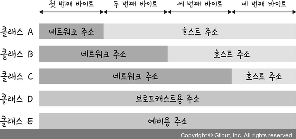

# IP 주소

## ARP (Address Resolution Protocol)

- IP 주소(논리적 주소)로부터 MAC 주소(물리적 주소)를 구하는 프로토콜
    - 사실 컴퓨터는 ARP를 통해 찾은 MAC 주소를 통해 통신함
- RARP: MAC → IP
- ARP Request 브로드캐스트(네트워크에 연결된 모든 호스트에 전송)를 보내 MAC 주소 찾음
- 해당 장치가 ARP Reply 유니캐스트로 MAC 주소 반환

## 홉바이홉 통신 (hop by hop)

라우팅 테이블의 IP를 통해 시작 주소부터 다음 IP로 계속해서 이동하는 라우팅 과정을 거쳐 패킷이 최종 목적지까지 도달하는 통신

### 라우팅 테이블

- 라우터에 들어있는 목적지 정보들과 목적지로 가기 위한 방법이 들어있는 리스트
- 게이트웨이와 모든 목적지에 대해 해당 목적지에 도달하기 위해 거쳐야 할 다음 라우터의 정보 가지고 있음

### 게이트웨이

- 서로 다른 통신망, 프로토콜을 사용하는 네트워크 간의 통신을 가능하게 함 (톨게이트 느낌)
- 서로 다른 네트워크상의 통신 프로토콜을 변환

## IP 주소 체계

- IPv4: 32비트를 8비트 단위로 점 찍음
    - ex) 123.45.67.89
- IPv6: 64비트를 16비트 단위로 점 찍음
    - ex) 2001:0230:abcd:ffff:0000:0000:ffff:1111

### 클래스 기반 할당 방식 (CIDR)

- A, B, C 는 일대일 통신, D는 멀티캐스트 통신, E는 예비로 사용

- A는 맨 왼쪽 비트(구분 비트)가 0이고, B는 10, C는 110임
  - A는 0.0.0.0 ~ 127.255.255.255의 범위를 가짐

- 클래스 A로 12.0.0.0이라는 네트워크를 부여받았다고 할 때 12.0.0.1 ~ 12.255.255.254를 호스트 주소로 사용할 수 있음
- CIDR 단점: 버리는 주소가 더 많음

### DHCP

- IP 주소 및 기타 통신 매개변수를 자동으로 할당
- 인터넷에 접속할 때마다 자동으로 IP 할당

### NAT

- 공유기(라우터)에 연결되어있는 각 사내 컴퓨터들의 사설 IP (192.168.0.xxx)를 받아와 유일한 공인 IP로 변환하고 외부 인터넷으로 공인 IP 주소정보를 보낸다.
  - 이때 외부 입장에서는 어느 회사의 영업부 사원이 보냈는지 알지 못하고 회사 공유기 주소만 알고 있는 상태이다.
- 답변을 하게되면, 인터넷 정보가 다시 회사 공유기로 올것이고 공유기에서는 이전에 요청한 정보들을 다 기억하고 있어서, 확인하고 그대로 보낸 사원에게 넘겨준다.
- private ip 를 사용하고 있는 컴퓨터가 사설 바깥쪽에 있는 public ip에 접속할 수 있게 됨
- 장점: 내부 네트워크에서 사용하는 IP와 외부에 드러나는 IP 주소가 다르기 때문에 보안적으로 안전
- 단점: 여러 명이 동시에 인터넷에 접속하기 때문에 속도가 느려질 수 있음