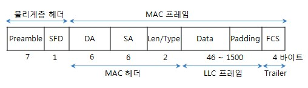
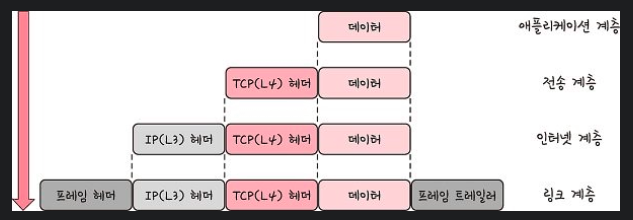

# TCP/IP 4계층

## 계층 구조

- TCP/IP 4계층: 링크, 인터넷, 전송, 애플리케이션 계층
- OSI 7계층: 물리, 데이터 링크, 네트워크, 전송, 세션, 프레젠테이션, 애플리케이션 계층
- 특정 계층이 변경되었을 때 **다른 계층이 영향을 받지 않음**

## **애플리케이션 계층**

- FTP, HTTP, SSH, SMTP, DNS 등
- 응용 프로그램이 사용되는 계층

## 전송 계층

- 송신자, 수신자 연결
- 데이터 스트림 지원, 신뢰성, 흐름 제어 제공
- **애플리케이션과 인터넷 계층 사이의 데이터가 전달**될 때 중계 역할

### TCP, UDP

- TCP: **패킷 사이 순서 보장, 연결을 하여 신뢰성 구축**, 가상회선 패킷 교환 방식
    - 가상회선 패킷 교환 방식: 노드들 따라서 전송된 순서대로 이동
- UDP: **순서 보장 X, 수신 여부 확인 X**, 단순히 데이터만 주는 데이터그램 패킷 교환 방식
    - 데이터그램 패킷 교환 방식: 패킷이 독립적으로 최적의 경로 선택하여 이동

### TCP 연결 성립 과정

- **3-way handshake**
    1. SYN: 클라이언트는 자신의 ISN(임의의 시퀀스 번호)을 담아 서버로 SYN 보냄
    2. SYN + ACK: 서버는 클라이언트의 SYN(요청)을 수신하고 서버의 ISN을 보내며(응답) 승인 번호로 클라이언트의 ISN + 1을 보냄
    3. ACK: 클라이언트는 서버의 ISN + 1한 값인 승인 번호를 담아 ACK에 보냄
    - 3-way handshake 이후 **신뢰성 구축**되고 데이터 전송 시작됨
    - **TCP는 이 과정이 있기 때문에 신뢰성이 있는 계층**이라고 함, UDP는 없음

### TCP 연결 해제 과정

- **4-way handshake**
    1. 클라가 연결 닫으려할 때 FIN으로 설정된 세그먼트를 보냄 → 클라는 FIN_WAIT_1 상태로 들어가서 서버 기다림
    2. 서버는 클라로 ACK라는 승인 세그먼트 보냄 → CLOSE_WAIT 상태에 들어감 → 클라가 세그먼트 받으면 FIN_WAIT_2 상태 됨
    3. 서버는 ACK 보내고 **일정 시간 이후**에 클라에게 FIN 세그먼트를 보냄
    4. 클라는 TIME_WAIT 상태가 되고 다시 서버로 ACK 보내서 서버는 CLOSED 상태가 됨 → 어느 정도의 시간을 대기한 후 연결이 닫히고 서버의 모든 자원의 연결 해제됨
    - **TIME_WAIT 상태에 대해서 생긴 의문: 왜 굳이 일정 시간 뒤에 닫을까?**
        1. 지연 패킷 발생 위험: 패킷이 늦게 도달하여 처리 못한다면, **데이터 무결성** 문제 발생
        2. 서버와 클라이언트 모두 연결이 닫혔는지 확인: LAST_ACK 상태에서 닫히면 새로 연결할 때 LAST_ACK로 되어있어서 접속 오류

### 인터넷 계층

- 장치로부터 받은 네트워크 패킷을 **IP 주소로 지정된 목적지로 전송**하기 위해 사용됨
- IP, ARP, ICMP
- 패킷을 수신해야 할 상대의 **주소를 지정**하여 데이터 전달
- 상대방이 받았는지 확인 X → 비연결적임

### 링크 계층

- 전선, 광섬유 등으로 **실질적인 데이터 전달**, 장치 간에 신호를 주고받는 **규칙**을 정함
- 네트워크 접근 계층이라고도 함
- 물리 계층, 데이터 링크 계층으로 나누기도 함
- 물리 계층: 무선 LAN, 유선 LAN을 통해 0과 1로 이루어진 데이터 보내는 계층
- 데이터 계층: ‘이더넷 프레임’을 통해 에러 확인, 흐름 제어, 접근 제어 담당
- **유선 LAN**
    - 이더넷, 전이중화 통신
    - 전이중화 통신
        - 양쪽 장치가 동시에 송수신 가능
    - CSMA/CD
        - 반이중화 통신 중 하나, 원래 이거 썼음
        - 충돌 발생하면 일정 시간 이후 재전송
        - 수신로, 송신로가 한 경로였음
    - TP 케이블, 광섬유 케이블로 유선 LAN 사용
- **무선 LAN**
    - 반이중화 통신
        - 양쪽 장치 동시에 통신 X
        - 전송이 완료될 때까지 기다려야 함
        - 둘 이상의 장치가 동시에 전송하면 충돌
    - CSMA/CA
        - 데이터를 보내기 전에 사전에 가능한 한 충돌을 방지함
          - 캐리어 감지: 회선이 비어있는지 확인
- 무선 LAN을 이루는 주파수
    - 2.4GHz: 장애물에 강함, 전파 간섭 심함
    - 5GHz: 사용 채널 많음, 동시 사용 가능해서 보통은 이걸 사용
- 와이파이
    - 무선 LAN 신호에 연결할 수 있게 하는 기술
    - 무선 접속 장치(AP)가 있어야됨 - 흔히 공유기라 함
    - 유선 LAN에 흐르는 신호를 무선 LAN 신호로 바꿔주어 신호가 닿는 범위 내에서 무선 인터넷 사용할 수 있게 됨
- BSS (Basic Service Set)
    - 단순 공유기를 통해 네트워크에 접속하는 것이 아닌 **동일 BSS 내에 있는 AP들과 장치들**이 서로 통신이 가능한 구조
    - 근거리 무선 통신 제공
- ESS (Extended Service Set)
    - 하나 이상의 연결된 BSS 그룹
    - 장거리 무선 통신 제공, 더 많은 가용성, 이동성
    - 한 장소에서 다른 장소로 이동하며 네트워크 연결 가능
- **이더넷 프레임**
    - 데이터 링크 계층은 이더넷 프레임을 통해 전달받은 데이터의 에러 검출, 캡슐화
  
    - Preamble: 이더넷 프레임 시작임을 알림
    - SFD(Start Frame Delimiter): 다음 바이트부터 MAC 주소 필드가 시작됨을 알림
    - DA, SA: 수신, 송신 MAC 주소
    - EtherType: 데이터 계층 위의 계층인 IP 프로토콜 정의, IPv4 or IPv6
    - Payload: 전달받은 데이터
    - CRC: 에러 확인 비트
- 계층 간 데이터 송수신 과정
    - 컴퓨터에서 다른 컴퓨터로 데이터 요청한다면? 
      1. 애플리케이션 계층에서 전송 계층으로 **요청 값들이 캡슐화 과정을 거쳐 전달**
      2. 다시 링크 계층을 통해 **해당 서버와 통신**
      3. 해당 서버의 링크 계층으로부터 애플리케이션 계층까지 **비캡슐화 과정**을 거쳐 데이터 전송
    - 캡슐화 과정
  
        - 상위 계층의 **헤더와 데이터**를 하위 계층의 데이터 부분에 포함시키고 해당 계층의 헤더를 삽입하는 과정 (이더넷 프레임 포함)
        - 애플리케이션 계층 → 전송 계층: **세그먼트, 데이터그램화** 되며 TCP(L4) 헤더가 붙여짐
        - 전송 계층 → 인터넷 계층: IP(L3) 헤더 붙여지며 **패킷화** 됨
        - 인터넷 계층 → 링크 계층: 프레임 헤더와 프레임 트레일러가 붙어 **프레임화** 됨
    - 비캡슐화
  
        - 캡슐화의 반대, 헤더 부분 제거
        - 프레임화 된 데이터 → 패킷화 → 세그먼트, 데이터그램화 → 메시지화됨

### PDU (Protocol Data Unit)

- 네트워크의 어떠한 계층에서 계층으로 데이터가 전달될 때, 한 덩어리의 단위를 PDU라고 함
- 제어 관련 정보가 포함된 **헤더**와 데이터를 의미하는 **페이로드**로 구성되어 있음
- 계층마다 이름 다름
    - 애플리케이션 계층: 메시지
    - 전송 계층: 세그먼트(TCP), 데이터그램(UDP)
    - 인터넷 계층: 패킷
    - 링크 계층: 프레임(데이터 링크 계층), 비트(물리 계층)
- ex) 애플리케이션 계층은 ‘메시지’를 기반으로 데이터 전달 → HTTP의 헤더가 문자열임
- PDU중 아래 계층인 비트로 송수신하는 것이 모든 PDU중 가장 빠르고 효율성 좋지만, 애플리케이션 계층에서는 문자열을 기반으로 송수신함 → 헤더에 다른 값들을 넣는 **확장이 쉽기 때문**