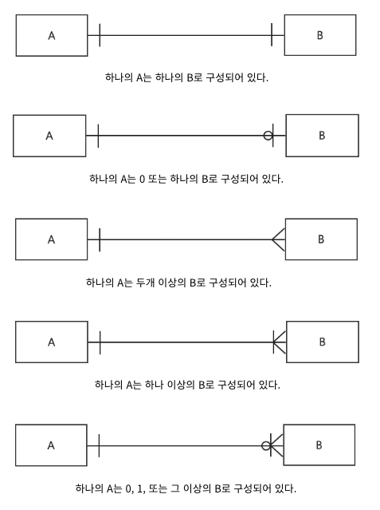
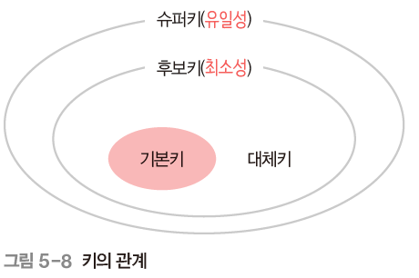

# 데이터베이스 기본

## 엔티티

> 여러 개의 속성을 지닌 것 (회원 엔티티 (Id, 이름, 주소 등))
>
- A 엔티티가 B 엔티티에 종속된다면, A를 약한 엔티티, B를 강한 엔티티라고 한다.
    - 방(A), 건물(B)

## 릴레이션

> 데이터베이스에서 **정보를 구분하여 저장하는 기본 단위**
>
- 회원 엔티티가 데이터베이스에서 관리될 때 릴레이션으로 변환됨
    - 관계형 데이터베이스: 테이블
    - NoSQL: 컬렉션

### 도메인

- 속성들이 가질 수 있는 값의 집합
    - 성별(속성) ↔ 남, 여 (도메인)
    - 국적(속성) ↔ 한국, 일본, … (도메인)

## 필드 타입

### 숫자 타입

| 타입 | 용량(바이트) | 최솟값(부호X) | 최솟값(부호O) | 최댓값(부호X) | 최댓값(부호O) |
| --- | --- | --- | --- | --- | --- |
| TINYINT | 1 | -128 | 0 | 127 | 255 |
| SMALLINT | 2 | -32768 | 0 | 32767 | 65535 |
| MEDIUMINT | 3 | -8388608 | 0 | 8388607 | 16777215 |
| INT | 4 | -2147483648 | 0 | 2147483648 | 4294967295 |
| BIGINT | 8 | -263 | 0 | 263-1 | 264-1 |

### 날짜 타입

### DATE

- 날짜 O, 시간 X
- 1000-01-01 ~ 9999-12-31
- 3바이트

### DATETIME

- 날짜 O, 시간 O
- 1000-01-01 00:00:00 ~ 9999-12-31 23:59:59
- 8바이트

### TIMESTAMP

- 날짜 O, 시간 O
- 1970-01-01 00:00:01 ~ 2038-01-19 03:14:07
- 4바이트

### 문자 타입

### CHAR, VARCHAR

- CHAR
    - 선언한 길이 값으로 고정됨
    - 검색 속도 빠름
- VARCHAR
    - 선언한 길이와 상관 없음 (해당 글자 비트 + 길이 기록용 1비트)
    - 데이터 공간 절약

### TEXT, BLOB

- TEXT
    - 큰 문자열 저장
    - ex) 게시판 본문
- BLOB
    - 이미지, 동영상 등 큰 데이터 저장

### ENUM, SET

- ENUM
    - 선언한 항목 중 한 개의 데이터만 선택
    - 0, 1 등의 정수값으로 매핑되어 메모리를 적게 사용함
- SET
    - 여러 개의 데이터 선택 가능

⇒ ENUM, SET 모두 어플리케이션 단의 수정이 있으면 수정이 불가피함

## 테이블 간의 관계

## 키

### 자연키와 인조키

- 자연키
    - 자연스럽게 뽑힌 키
    - ex) 유저 테이블에서의 주민등록번호
- 인조키
    - 인위적으로 부여한 키
    - MySQL의 auto increment

### 외래키

- 다른 테이블의 기본키를 그대로 참조하는 키
- 객체와의 관계 식별

### 후보키

- 기본키가 될 수 있는 후보들
- 유일성, 최소성 동시에 만족

### 대체키

- 후보키가 두 개 이상일 때, 기본키를 정하고 남은 키

### 슈퍼키

- 레코드를 유일하게 식별할 수 있는 유일성을 갖춘 키