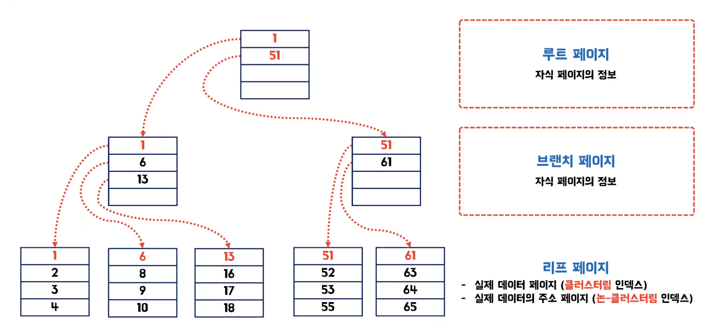
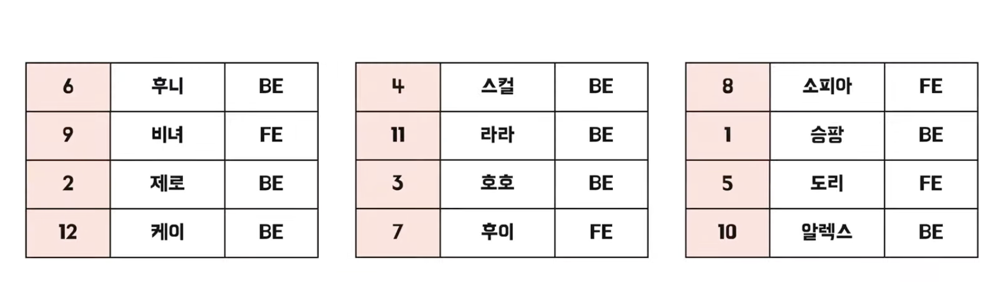
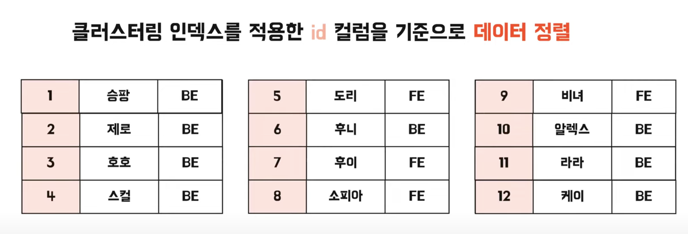
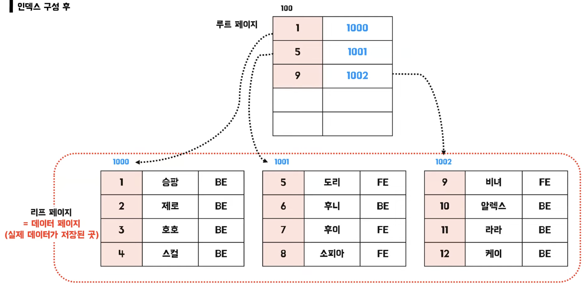
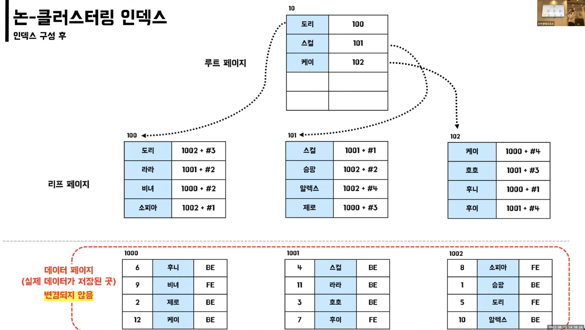
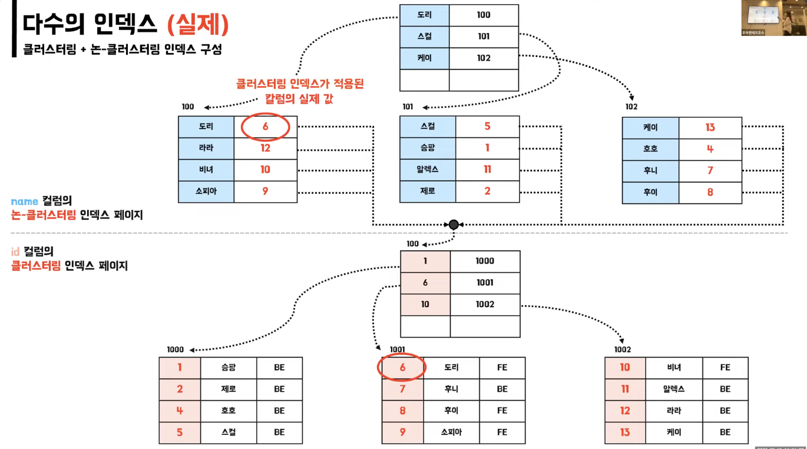

# 인덱스

## 인덱스란?

- 데이터베이스에서 데이터를 빠르게 찾기 위해 사용하는 기술
- ex) 책의 ‘찾아보기’

## B-Tree 구조

- 루트, 브랜치, 리프 페이지로 나뉨
- 조회 성능 향상 (Select)

### Insert

- 리프 페이지에 삽입을 할 때, 리프 페이지 내부에 삽입할 공간이 있다면 큰 부담은 없이 삽입됨
- 하지만 내부에 공간이 없다면, **새로운 페이지를 확보한 뒤 분할**을 해줘야됨
    - DB가 느려지고, 성능에 영향을 줌

### Delete

- 데이터가 실제로 지워지지는 않고 사용안함 처리 됨

### Update

- Delete 작업 (사용안함 처리) 후 Insert 작업

### Insert, Delete, Update 정리

- 페이지 분할, 사용안함 표시로 인해 **인덱스 조각화, 성능 저하**

## 클러스터링 인덱스

- primary key 지정 시 자동 생성
    - 혹은 not null과 unique 제약 조건을 함께 적용

### 클러스터링 인덱스 적용 전

### 클러스터링 인덱스 적용 후 - 정렬

### 클러스터링 인덱스 적용 후 - 최종

- 실제 데이터 자체가 정렬됨
- 테이블 당 1개만 존재할 수 있음
- 리프 페이지가 데이터 페이지임

## 논-클러스터링 인덱스 (세컨더리 인덱스)

- unique 제약 조건 사용 시 자동 생성
    - 혹은 인덱스 자체 생성
- 실제 데이터 페이지는 그대로 존재함
- 별도의 인덱스 페이지가 생성되기 때문에 **추가 공간**이 필요함
- 리프 페이지에 **실제 데이터 페이지의 주소**를 담고 있음

## 클러스터링 + 논-클러스터링 인덱스

### 잘못된 방식

1. 논-클러스터링 인덱스 페이지에서 실제 데이터 페이지의 주소를 조회
2. 해당 데이터 페이지로 가서 조회..?

### 실제 방식
^

1. 논-클러스터링 인덱스 페이지에서 실제 값 (예시에서는 ID)을 찾음
2. 해당 ID에 대해 클러스터링 인덱스 페이지에서 루트 페이지부터 기존 방식대로 찾아감

### 왜 이런 방식으로 작동할까?

- Insert 시 페이지 분할이 발생할 수도 있음
    - 이때 논-클러스터링 인덱스 페이지에서 실제 데이터 페이지의 주소로 저장되어 있다면, 페이지 분할 발생 시 매번 주소값 변경이 필요함

## 인덱스 최적화

- 카디널리티가 높은 칼럼
    - 카디널리티: 유니크한 정도
- Where, Join, Order By 절에 자주 사용되는 칼럼
- Insert, Update, Delete가 자주 발생하지 않는 칼럼
- 규모가 작지 않은 테이블
    - 효과 미비