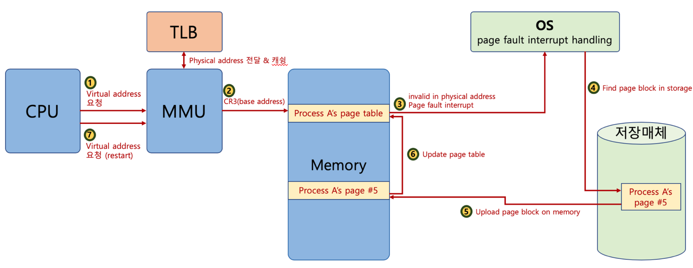

# 메모리

## 메모리 계층

- 네 계층 모두 휘발성
- 위로 갈수록(레지스터) 속도가 빠르고, 용량 작음
- 아래로 갈수록(디스크) 속도가 느리고, 용량 큼

## 캐시

- 데이터를 미리 복사해 놓는 임시 저장소
- 속도 차이에 따른 병목 현상 해결
- 속도 차이를 해결하기 위해 계층과 계층 사이에 있는 계층을 캐싱 계층이라 함

### 시간 지역성

- 최근 사용한 데이터에 다시 접근하려는 특성

### 공간 지역성

- 최근 접근한 데이터를 이루고 있는 공간이나 그 가까운 공간에 접근하는 특성

## 캐시히트와 캐시미스

- 캐시히트: 캐시에 원하는 데이터가 있는 경우
    - CPU 내부 버스 기반 동작 → 빠름
- 캐시미스: 캐시에 없다면 메모리로 가서 찾아오는 경우
    - 시스템 버스 기반 동작 → 느림

### 캐시 매핑

> 캐시가 히트되기 위해 매핑하는 방법, CPU의 **레지스터와 RAM 간**에 데이터를 주고받을 때 사용
>
- 직접 매핑
    - 메인 메모리를 일정 크기 블록으로 나누고, 각 블록을 캐시의 정해진 위치에 매핑하는 방식
    - 구현 단순함
    - 라인이 공유 중이면 swap 발생
    - 00010과 10010 데이터를 구분할 수 없기 때문에 앞의 두 비트로 **태그**를 만들어 사용
    - Valid bit로 데이터 유무를 나타냄
- 연관 매핑
    - 캐시의 어떤 라인과도 무관하게 매핑
    - 충돌 적음
    - 모든 블록 탐색 → 속도 저하
- 집합 연관 매핑
    - 메모리 블록 그룹이 하나의 집합 공유
    - 구현 복잡함

## 가상 메모리

- 실제로 이용 가능한 메모리 자원을 추상화하여 사용자들에게 용량이 큰 메모리로 보이게 만드는 것
- 가상 주소(logical address)와 실제 주소(physical address)로 나뉨
    - 가상 주소는 메모리관리장치(MMU)에 의해 실제 주소로 변환됨
- 가상 주소와 실제 주소가 매핑되어있고 프로세스의 주소 정보가 들어있는 **페이지 테이블**로 관리됨
    - TLB를 사용함
    - TLB : 메모리와 CPU 사이에 있는 주소 변환을 위한 캐시

### 스와핑

- 가상 메모리에는 있지만 실제 메모리에는 없는 데이터에 접근할 경우 페이지 폴트 발생
    - 당장 사용하지 않는 영역을 하드디스크로 옮김 → 필요할 때 다시 RAM으로 불러옴 → 필요 없어지면 다시 하드디스크로 옮김 (반복) ⇒ 스와핑

### 페이지 폴트

1. CPU가 물리 메모리를 확인하여 해당 페이지가 없으면 **트랩**을 발생해서 운영체제에 알림
2. 운영체제가 CPU 동작 멈춤
3. 운영체제가 페이지 테이블 확인 → 가상 메모리에 페이지 있는지 확인 → 없으면 프로세스 중단 → 물리 메모리에 비어 있는 프레임 확인 → 없으면 스와핑
4. 비어 있는 프레임에 해당 페이지 로드
5. CPU 다시 시작

> 가상 메모리를 사용하는 최소 크기 단위를 **페이지**, 실제 메모리를 사용하는 최소 크기 단위를 **프레임**이라고 한다.
>

### 스레싱(thrashing)

- 페이지 폴트율이 높은 것을 의미함
- 메모리에 너무 많은 프로세스가 동시에 올라감 → 스와핑 빈번해짐 → 문제
- 해결 방법
    - 작업 세트 (working set): 프로세스의 과거 사용 이력(지역성)을 통해 결정된 페이지 집합을 만들어서 미리 메모리에 로드
    - PFF: 페이지 폴트 빈도 조절 → (상한선 → 페이지 늘림, 하한선 → 페이지 줄임)

### 메모리 할당

- 연속 할당: 연속적으로 프로세스에게 메모리를 할당함
    - 고정 분할 방식: 메모리를 미리 나누어 관리, 내부 단편화 발생
    - 가변 분할 방식: 동적으로 메모리 나누어 관리, 외부 단편화 발생
        - 최초적합: 위쪽이나 아래쪽부터 찾으면 바로 할당
        - 최적적합: 프로세스의 크기 이상인 공간 중 가장 작은 홀부터 할당
        - 최악적합: 프로세스의 크기와 가장 많이 차이가 나는 홀에 할당
    - 내부 단편화: 메모리를 나눈 크기보다 프로그램이 작아서 **들어가지 못하는 공간이 많이 생기는 현상**
    - 외부 단편화: 메모리를 나눈 크기보다 **프로그램이 커서** 발생
- 불연속 할당
    - 페이징: 동일한 크기의 페이지 단위로 나누어 메모리의 서로 다른 위치에 프로세스 할당
    - 세그멘테이션: 페이지 단위가 아닌 의미 단위인 세그먼트로 나누는 방식
        - 프로세스는 코드, 데이터, 힙, 스택 등으로 이루어지는데, 코드와 데이터, 함수 단위로도 세그먼트를 나눌 수 있다는 뜻
    - 페이지드 세그멘테이션: 공유나 보안을 세그먼트로, 물리적 메모리는 페이지로 나눔

## 페이지 교체 알고리즘

### FIFO

- 가장 먼저 온 페이지를 교체

### LRU

- 참조가 가장 오래된 페이지 교체

### LFU

- 가장 참조 횟수가 적은 페이지 교체