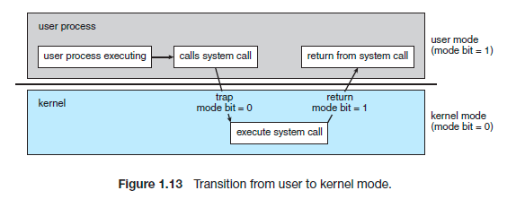

# 운영체제와 컴퓨터

## 운영체제의 역할

1. CPU 스케줄링과 프로세스 관리: CPU 소유권, 프로세스 생성, 삭제, 자원 할당, 반환
2. 메모리 관리: 한정된 메모리를 어떤 프로세스에 줄 지 관리
3. 디스크 파일 관리: 디스크 파일을 어떤 방법으로 보관할 지
4. I/O 디바이스 관리: 마우스, 키보드와 컴퓨터 간에 데이터 주고받는 것 관리

## 운영체제의 구조

- 리눅스는 GUI대신 CUI
- 드라이버: 하드웨어를 제어하기 위한 소프트웨어

### 시스템 콜

- 운영체제가 **커널에 접근하기 위한 인터페이스**
    - 유저 프로그램이 운영체제의 서비스를 받기 위해 커널 함수를 호출할 때 사용
- I/O 요청으로 트랩(trap)을 발동하면 올바른 요청인지 확인 후 **유저 모드**가 시스템 콜을 통해 **커널 모드**로 변환되어 실행됨
    - I/O 요청 → 트랩 → 시스템 콜(유저 모드) → 커널 모드로 변환 → 실행

<aside>
☝🏻 왜 유저 모드와 커널 모드를 나눌까?

- 컴퓨터 자원에 대한 직접 접근 차단
- 프로세스 간의 영향 최소화
</aside>

### modebit

- 유저 모드와 커널 모드를 modebit으로 구분함 (플래그 변수)

## 컴퓨터의 요소

- CPU
- DMA 컨트롤러
- 메모리
- 타이머
- 디바이스 컨트롤러
- 등등

## CPU

인터럽트에 의해 단순히 **메모리에 존재하는 명령어를 해석해서 실행**

### 구분

- 제어장치
- 레지스터
- 산술논리연산장치

### 제어장치

- 프로세스 조작 지시
- 입출력 장치 간의 통신 제어
- 명령어들을 읽고 해석
- 데이터 처리 순서 결정

### 레지스터

- 임시기억장치
- CPU와 직접 연결되어있어서 연산 속도가 메모리보다 훨씬 빠른(수십 ~ 수백배)
- CPU는 자체적으로 데이터를 저장할 수 없어서 레지스터를 거쳐 데이터를 전달

### 산술 논리 연산장치

- 두 숫자의 산술 연산 담당

## CPU의 연산 처리

1. 제어장치가 메모리에 계산할 값 로드, 레지스터에도 로드
2. 제어장치가 레지스터에 있는 값을 계산하라고 산술논리연산장치에 명령
3. 제어장치가 레지스터에서 메모리로 계산한 값 저장

### 인터럽트

- 어떤 신호가 들어왔을 때 CPU를 잠깐 정지시키는 것
    - IO 디바이스로 인한 인터럽트
    - 0으로 나누는 산술 연산
    - 프로세스 오류
- 인터럽트 벡터로 가서 인터럽트 핸들러 함수 실행
    - 인터럽트 벡터: 인터럽트 핸들러 함수들이 모여 있는 곳
    - 인터럽트 간에는 우선순위가 있음

### 인터럽트 종류

1. 하드웨어 인터럽트
    1. 키보드, 마우스 연결 등의 IO 디바이스에서 발생하는 인터럽트
2. 소프트웨어 인터럽트
    1. 트랩이라고도 함
    2. 프로세스 오류 등으로 프로세스가 **시스템콜 호출**할 때 발생

## CPU 이외 구성 요소들

### DMA 컨트롤러

- I/O 디바이스가 메모리에 직접 접근할 수 있도록 하는 하드웨어 장치
- CPU에만 인터럽트 요청이 너무 많아서 CPU 부하 막아줌

### 메모리

- 데이터, 상태, 명령어 등을 기록하는 장치
- 보통 RAM을 메모리라고 함

### 타이머

- 특정 프로그램에 시간 제한을 다는 역할
- 시간이 많이 걸리는 프로그램에 제한 주기 위해 존재

### 디바이스 컨트롤러

- 컴퓨터와 연결되어있는 IO 디바이스들의 작은 CPU라고 생각하면 됨