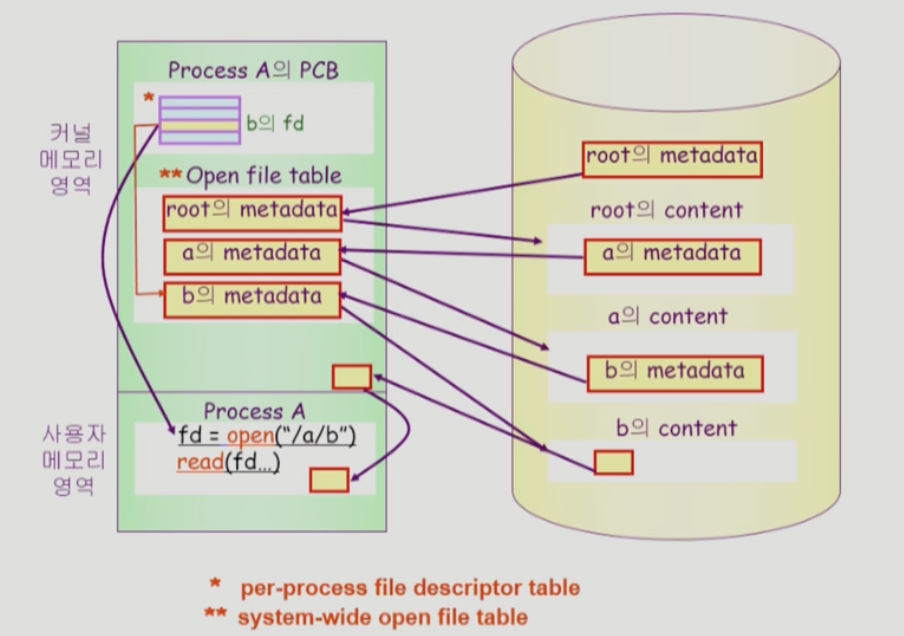

# [9장] File Systems

## File

- metadata
    - 파일 자체의 내용이 아니라 **파일을 관리하기 위한 각종 정보**들
        - 파일 이름, 유형, 저장된 위치 등
        - 접근 권한, 시간, 소유자 등
- file system
    - 운영체제에서 파일을 관리하는 부분

## Directory

- **파일의 metadata 중 일부를 보관**하고 있는 특별한 파일
- partition = Logical Disk
    - 하나의 디스크 안에 여러 파티션을 둠
    - 각각의 파티션에 file system 깔거나 swap area로 사용 가능

### open()

### open

1. Process A가 open() 요청을 한다.
    1. system call
2. root의 metadata를 먼저 메모리에 올림 (open)
3. root의 metadata를 열어서 root의 content를 확인함
4. root의 content 안에 있는 a의 metadata를 open함
5. 마찬가지로 a의 metadata를 열어서 a의 content를 확인함
    1. a가 디렉토리이므로, a의 content안에는 b의 metadata가 들어있을 거임
6. b의 metadata를 open함

### read

1. b의 open이 끝났으니 open(”/a/b”)는 결과값을 반환해야되는데, 이때 각 프로세스마다 open한 file의 위치를 나타내는 index인 fd(file descriptor)를 반환함
    1. 즉, 다시 파일을 열 필요가 없고, b의 fd만 찾아가면 b의 metadata를 확인할 수 있음
2. read의 파라미터는 fd이고, read를 실행하면, b의 metadata를 통해 b의 content 접근함
3. b의 content 일부를 메모리에 저장하고 사용자에게 전달함
    1. caching

참고) 프로세스마다 같은 파일의 다른 부분을 읽고있을 수도 있기 때문에 프로세스 마다 별도의 offset을 가져야함

### File Protection

- Matrix에 권한 저장
- 권한 별로 그룹(3비트)으로 구분 (owner, group, public 각 3비트씩)
    - UNIX
        - “rwxr—r—”
        - rwx, r—, r— 각 3비트씩 총 9비트
- password
    - 파일마다 비밀번호를 둠

### File System의 Mounting

disk를 파티셔닝해서 각각 file system을 깔 수 있다고 했는데, 그렇다면 disk1에서 disk2, 3의 file system의 파일들은 어떻게 가져올까?

⇒ disk1의 file system에 disk 2,3의 root 를 그대로 가져다 붙일 수 있음(mount)