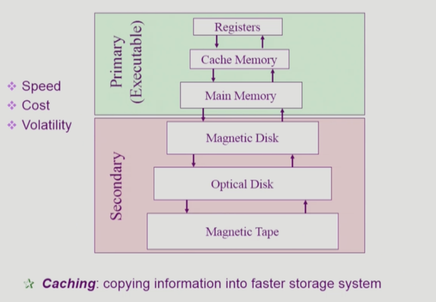
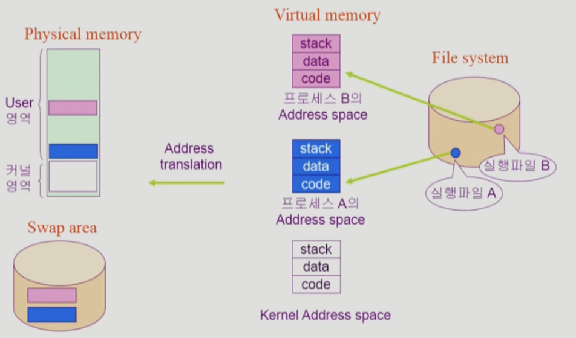
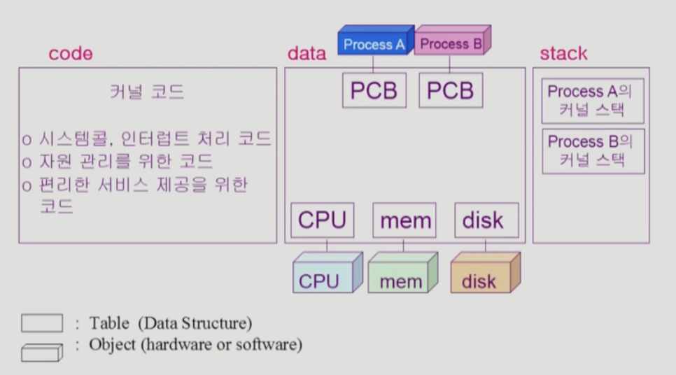

# [3강] System Structure & Program Execution 2

## 동기식 입출력과 비동기식 입출력

### 동기식 입출력

- I/O 요청 후 **입출력 작업이 완료된 후**에 CPU 제어권이 사용자 프로그램에 넘어감
- 구현 방법
    1. I/O 끝날 때 까지 기다리기
        - CPU 낭비
    2. I/O 요청을 함 → 다른 프로그램에게 CPU 넘김

### 비동기식 입출력

- I/O가 시작된 후 작업이 완료되지 않아도 CPU 제어권이 사용자 프로그램에 넘어감
- 동기식 입출력의 구현 방법 2와 다른 점
    - 한 프로세스 내에서 벌어지는 일임
    - 구현 방법 2는 다른 프로세스(프로그램)한테 넘어가기 때문에, I/O 요청을 한 프로그램은 그 뒤 작업을 수행하지 않음

## 저장장치 계층 구조

- Register, Cache Memory는 CPU 안에 있음
- Volatility: 휘발성
- Primary는 CPU가 직접 접근 가능한 메모리

## 프로그램의 실행 (메모리 load)

A.exe, B.exe를 실행한다고 했을 때 어떤 일이 일어날까?

- 바로 Physical memory에 올라가지 않고, 각 **프로그램마다 독립적으로 갖는 메모리인 Virtual memory**를 할당 받음
    - Virtual memroy는 stack, data, code, heap으로 이루어져 있음
        - **code**: 프로그램을 실행할 때 필요한 코드들
        - **data**: 전역 변수, 동적 할당된 데이터
        - **stack**: 함수 호출과 관련된 정보
- 각 Virtual memory의 주소는 독립적이기 때문에 0 부터 시작되는데, 이때 Physical memory에서의 주소는 0부터가 아니라 1000 부터일 수 있음
- 또한 Virtual memory 전부를 Physical memory에 차례대로 올리는게 아님, **따로따로 필요에 따라 찢어져서 Physical memory에 할당**이 됨
    - 만약 A.exe에서 hello 라는 함수를 실행하고 있다면, 그에 필요한 부분만 메모리에 올려서 사용하고, 사용안하면 다시 쫓아냄
    - 이때 필요에 따라 사용하지 않는 부분은 Disk의 Swap area에 내려놓게 됨 (스와핑)
- 그렇기 때문에 각 프로세스의 logical address를 Physical address로 변환을 해줘야됨

## 커널 주소 공간의 내용

- 커널도 하나의 프로그램이기 때문에 code, data, stack으로 이루어져 있음
    - code: 자원 관리, 편리한 서비스, 인터럽트 처리 코드 등
    - data: 운영체제가 CPU, Memory, Disk와 소통하기 때문에, 이런 **하드웨어들을 관리하기 위한 자료구조들** (위의 그림은 추상적으로 그려놓은 것), 어떤 프로세스가 얼마나 CPU를 썼는지 등에 대해 관리하기 위한 자료구조인 **PCB**를 가짐
    - stack: 운영체제 또한 함수 구조로 짜여져있기 때문에 stack이 있음, 하지만 어떤 프로그램이 커널 코드를 사용 중인가에 따라 구분해야하기 때문에 **프로그램마다 stack을 따로 둠**