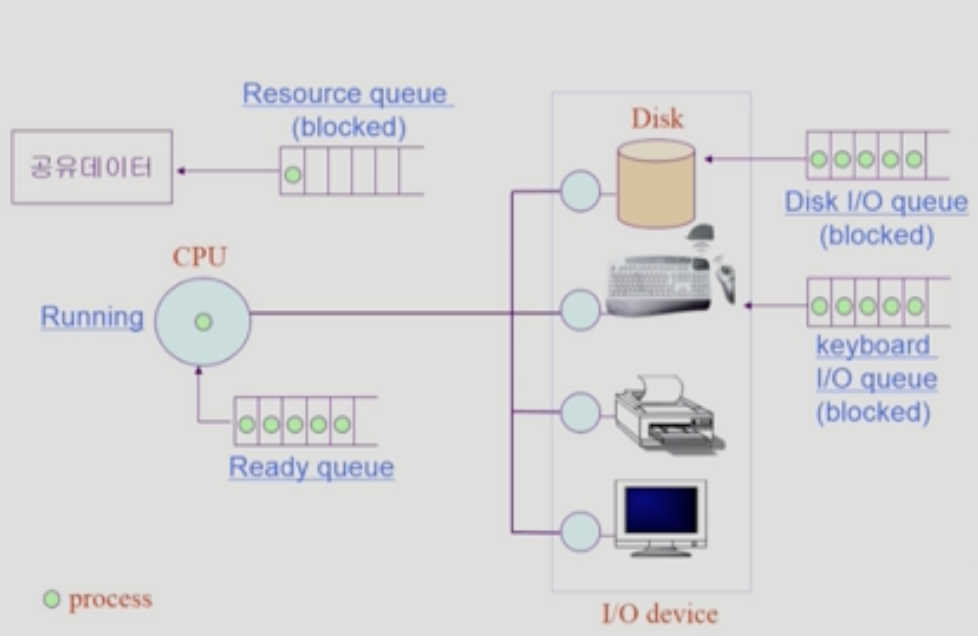
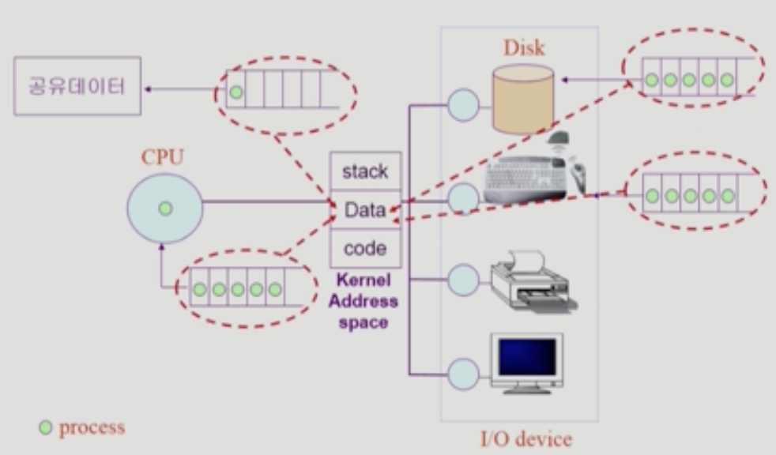
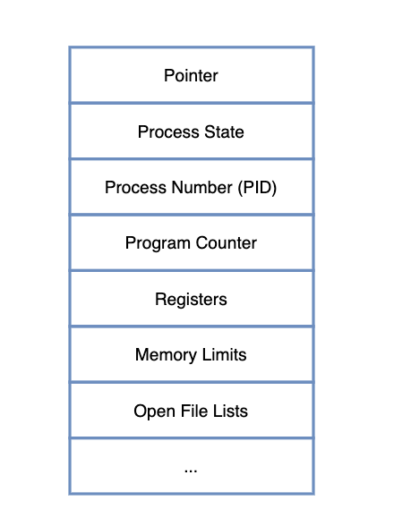
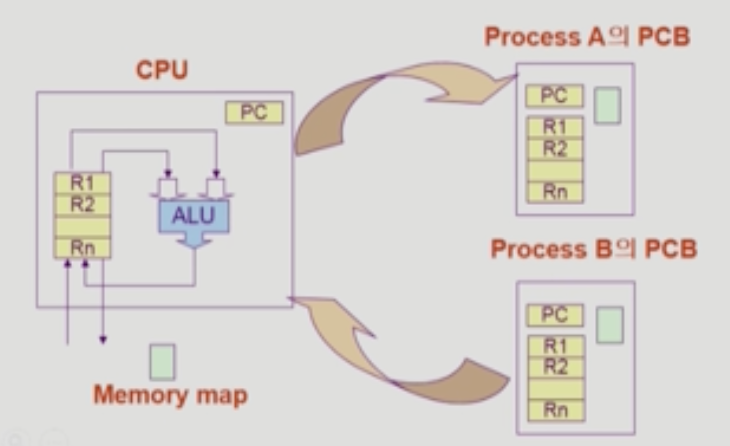
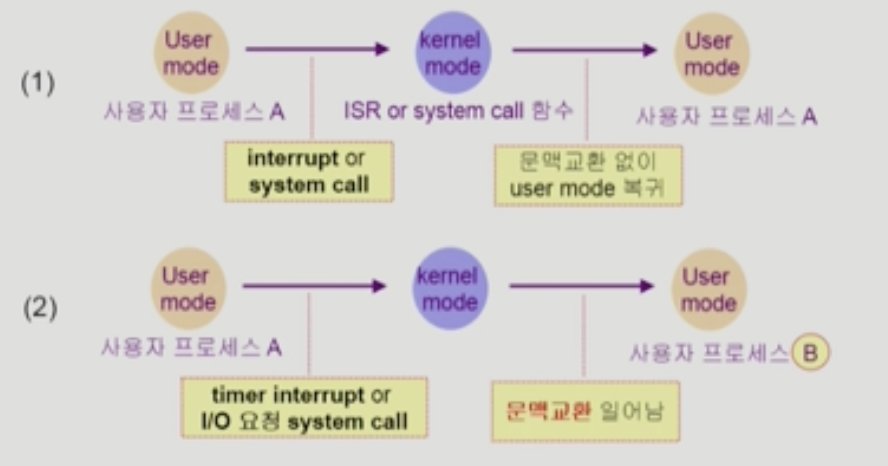
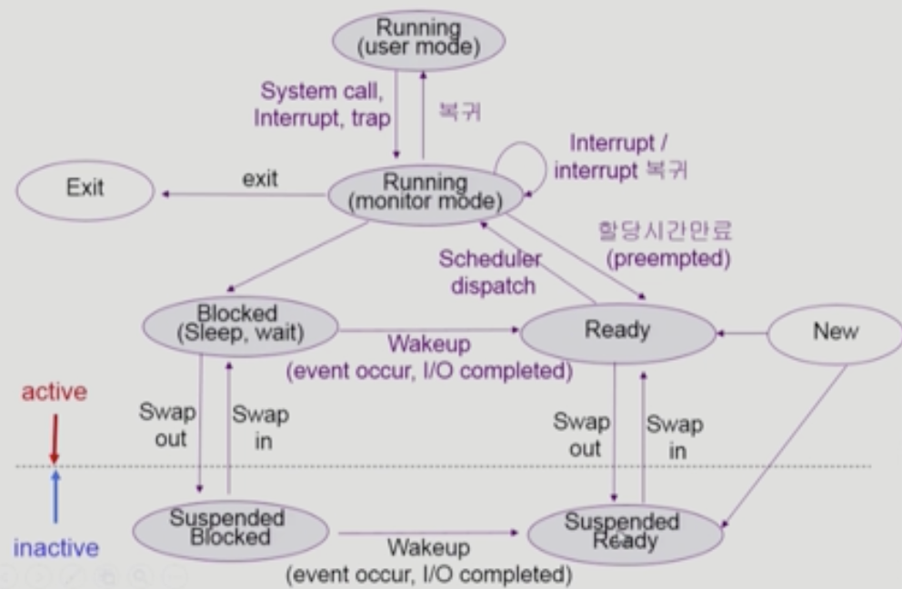
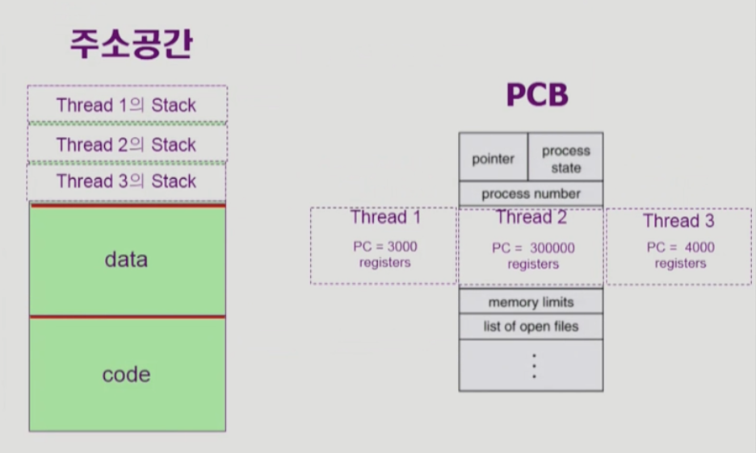

# [3장] Process 1

## Process란?

- 실행 중인 프로그램

### 프로세스의 문맥 (context)

현재 어떤 함수를 호출해서 stack에 쌓여있는가?, data 영역에 변수의 값은 얼마인가? Register에 어떤 값을 넣어두고, 어떤 Instruction까지 실행했는가? 등을 알아야함

- CPU 수행 상태를 나타내는 하드웨어 문맥
    - Program Counter가 어디를 가리키고 있었나?
    - **Register에 어떤 값이 들어있었나**?
- 프로세스의 주소 공간
    - code, data, stack에 어떤 값이 들어있는가?
- 프로세스 관련 커널 자료 구조
    - PCB (Process Control Block)
    - Kernel stack

## 프로세스의 상태 (Process State)

- Running
    - CPU를 잡고 Instruction을 수행 중인 상태
- Ready
    - CPU를 기다리고 있는 상태
    - 필요한 부분은 Physical memory에 올라와있는 상태
    - 다른 모든 조건은 만족하고 CPU만 오면 되는 상태
- Blocked (wait, sleep)
    - CPU를 주어도 Instruction을 수행할 수 없는 상태
    - ex) 자신이 요청한 I/O가 끝나야 Instruction을 실행해야 할 때 (Disk에서 file을 읽어올 때)

---

경우에 따라 아래의 두 상태도 포함함

- New
    - 프로세스가 생성 중인 상태
- Terminated
    - 수행이 끝났지만, 정리할 게 남은 상태

---

## 프로세스의 상태

- Ready queue에 들어갔다 나왔다 반복
- 공유 데이터에 접근할 때에도 Resource queue에 들어가서 대기함
- 놀이기구 줄 서는 것과 같음

- Kernel이 data 영역에 자료구조인 queue를 만들고 그 안에서 관리함
    - 각 I/O 디바이스에 queue가 있는게 아님

## Process Control Block (PCB)

운영체제가 각 프로세스를 관리하기 위해 **프로세스 당 유지하는 정보**

1. OS가 관리상 사용하는 정보
    - Process state (running, ready ..)
    - Process ID
    - scheduling information, priority
2. CPU 수행 관련 하드웨어 값
    - Program counter, registers
3. 메모리 관련
    - code, data, stack의 위치 정보
4. 파일 관련
    - Open file description
        - 어떤 파일을 사용하고 있는 지

## Context Switch

CPU를 한 프로세스에서 다른 프로세스로 넘겨주는 과정

CPU가 다른 프로세스에게 넘어갈 때 운영체제는 아래의 작업들을 수행함

- CPU를 내주는 프로세스의 상태를 해당 프로세스의 PCB에 저장함
    - 이때 PCB는 커널 공간의 data 영역에 있음
    - memory map 또한 저장
- CPU를 새롭게 얻는 프로세스의 상태를 PCB에서 읽어옴

System call이나 Interrupt 발생 시 반드시 context switch가 일어나는 것은 아님

- (1)의 경우에도 CPU 수행 정보 등 context의 일부를 PCB에 save 해야 하지만, 문맥 교환을 하는 (2)의 경우 그 부담이 훨씬 큼 (eg. cache memory flush)

⇒ 결국 프로세스가 아예 바뀌는 것이 아니라면 context switch가 아님

## 프로세스를 스케줄링하기 위한 큐

- Job queue
    - 현재 시스템 내에 있는 모든 프로세스의 집합
    - Ready queue와 Device queue에 있는 프로세스들을 포함함
- Ready queue
    - CPU를 기다리는 줄(프로세스)
- Device queues
    - I/O device의 처리를 기다리는 줄(프로세스)

> 각 queue에 줄을 세울 때는 **PCB**를 세운다. PCB 구조를 보면 pointer가 있는데, 이때 사용되는 것
>

## 스케줄러의 종류

1. Short-term scheduler (CPU scheduler)
    - 어떤 프로세스를 다음 번에 running시킬 지 결정
    - **프로세스에게 CPU를 주는 문제를 다룸**
    - 충분히 빨라야 함 (ms 단위)
2. Long-term scheduler (Job scheduler)
    - 시작 프로세스 중 어떤 것들을 ready queue로 보낼 지 결정
        - new → ready로 넘어갈 때 admit이 필요한데, 이때 admit이란 메모리를 줄지 말지를 의미함
    - **프로세스에 memory와 각종 자원을 주는 문제를 다룸**
    - **degree of Multiprogramming**을 제어
        - 메모리에 프로그램이 몇 개 올릴지를 제어
        - 메모리에 많은 프로그램이 올라가도 성능이 좋지 않고, 너무 적어도 좋지 않음
    - time sharing system에서는 장기 스케줄러가 없고, 무조건 ready queue에 들어감 (현재 시스템은 장기 스케줄러가 없음)
3. Medium-Term scheduler (Swapper)
    - 현재 사용하는 시스템이 장기 스케줄러가 없다면, degree of Multiprogramming 문제를 어떻게 해결하나?
        - 여유 공간 마련을 위해 프로세스를 통째로 메모리에서 디스크로 쫓아냄
    - **프로세스에게서 memory를 뺏는 문제를 다룸**
    - 일단 메모리에 다 올려두고, 너무 많으면 빼앗아 버림

## 추가된 프로세스의 상태

[프로세스의 상태 (Process State)](#프로세스의-상태process-state)

위에서 프로세스의 상태에는 크게 3가지로 나뉘었는데, Medium-Term scheduler 때문에 프로세스의 상태가 추가가 됨

- Suspended (stopped)
    - 외부적인 이유로 프로세스의 수행이 정지된 상태
    - 프로세스는 통째로 디스크에 swap out 됨

Blocked vs Suspended

- Blocked: 자신이 요청한 event가 만족되면 Ready
- Suspended: 외부에서 resume해 주어야 Active

### 프로세스 상태도

- Running이 두 가지로 나뉨
    - System call이 발생한다고 해서 기존 프로세스가 running하지 않는게 아님
    - 또한 kernel mode로 넘어갔다고 해서 운영체제가 해당 프로그램을 실행한다고 말하지는 않음, 사용자 프로그램이 실행하는 것임
- Blocked는 active한 상태
- Suspended는 inactive한 상태
    - 외부에서 멈추게 한 상태
    - Suspended Blocked에서도 I/O 작업이 수행이 되면, Suspended Ready로 바뀔 수는 있음

## Thread

- Physical memory에는 프로그램이 있고, PCB에 여러 개의 스레드를 두어서 data의 다른 부분을 가리켜서 서로 다른 일을 수행하는 것
- Stack 또한 별도로 다룸
- 프로세스 하나에 **CPU 수행 단위만 여러 개** 두는 것

### 구성 요소

- pc (program counter)
- register set
- stack space

### 다른 thread와 공유하는 부분 (task)

- **code** section
- **data** section
- OS resources

## 스레드의 장점

- 하나의 서버 스레드가 blocked 상태인 동안에도 동일한 task 내의 다른 스레드가 실행되어 빠른 처리를 할 수 있다.
    - 브라우저에 www.naver.com을 검색한다고 했을 때 웹 서버 정보를 읽어오는 데에는 오랜 시간이 걸리고 이 또한 I/O 요청이기 때문에 blocked 됨. 그렇게 되면 사용자는 홈페이지가 뜰 때까지 아무 행동도 하지 못함
    - 멀티 스레드에서는 사진같이 오래 걸리는 리소스를 하나의 스레드가 요청을 하고 blocked됨 → 다른 스레드가 텍스트 같은 것들을 먼저 받아와서 보여줄 수 있음
- 동일한 일을 수행하는 다중 스레드가 협력하여 높은 throughput과 성능 향상
- 자원 공유
    - code, data는 공유를 하기때문에 자원을 효율적으로 사용할 수 있음
- 경제적임
    - process 하나 만드는 것보다 thread 하나 더 만드는게 훨씬 오버헤드가 적음