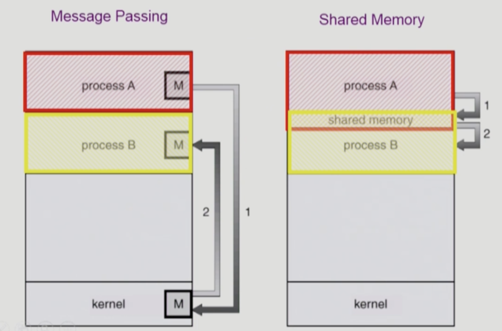

# [4장] Process Management

## 프로세스 생성

부모 프로세스가 자식 프로세스를 생성함

- 트리 구조
- 프로세스가 실행되려면 자원이 필요함
    - 운영체제로부터 받음
- 자원의 공유
    1. 부모와 자식이 모든 자원 공유하는 모델
    2. 일부 공유하는 모델
    3. **전혀 공유하지 않는 모델 (원칙적으로 이게 맞음)**
        1. 리눅스같은 효율적인 모델들은 최대한 공유할 것은 공유함
        2. Copy-on-write: 내용이 바뀔 때 새로운 걸 만들겠다. 그 전에는 공유하겠다는 것
- 수행
    - 부모와 자식이 공존하며 수행하는 모델
    - 자식이 종료될 때까지 부모가 기다리는 모델
- 주소 공간
    - 자식은 **부모의 공간을 복사**함
    - 자식은 그 공간에 새로운 프로그램을 올림
- ex) 유닉스
    - **fork(): 시스템 콜이 새로운 프로세스 생성**
        - 부모를 그대로 복사 (PID를 제외한 OS data + binary)
        - 주소 공간 할당
    - exec()
        - 새로운 프로그램을 메모리에 올림 = **다른 프로그램으로 덮어씌움**
        - 복제만 하고 덮어씌우지 않을 수도 있음

## 프로세스 종료

- 프로세스가 마지막 명령을 수행한 후 운영체제에게 이를 알려줌 (exit 시스템 콜)
    - 자식이 부모에게 output data를 보냄 (wait 시스템 콜)
    - 프로세스의 각종 자원들이 운영체제에게 반납됨
- 부모 프로세스가 자식의 수행을 강제 종료시킴 (abort 시스템 콜)
    - 자식이 할당 자원의 한계치를 넘어선 경우
    - 자식에게 시킬 일이 없는 경우
    - 부모가 종료(exit)되는 경우

## fork()

```c
// fork() 예시 코드
int main() {
	int pid;
	pid = fork(); // <- 부모 프로세스라면 fork()의 반환값은 양수
	if (pid == 0)
		printf("I'm child");
	else if (pid > 0)
		print("I'm parent");
}
```

- fork()를 실행하면 위의 코드를 그대로 복사하지만, 부모 프로세스의 PC가 가리키는 값이 pid = fork() 이후이기 때문에, 자식 프로세스 또한 그 다음 코드인 if (pid == 0) 부터 시작함

⇒ 근데 이렇게 되면, if 로 분기처리하여 다른 로직을 실행할 수는 있지만, 같은 코드를 가진 프로세스들만 가득할 것임

## exec()

```c
// exec() 예시 코드
int main() {
	int pid;
	pid = fork();
	if (pid == 0)
		printf("I'm child");
		execlp("/bin/date", "/bin/date", (char *) 0); // bin에 있는 date 라는 프로그램 실행
	else if (pid > 0)
		print("I'm parent");
}
```

- exec()이 실행되면, 위의 코드는 없어지고 새로운 코드가 덮어씌워짐
- 왜 두 번 적나? → execlp의 형식임

## wait()

```c
// wait() 예시 코드
int main() {
	int childPid;
	childPid = fork();
	if (childPid == 0)
		// child 작업 수행 ...
	else {
		wait();
	}
}
```

- 프로세스 A가 wait() 시스템 콜을 호출하면,
    - 커널은 child가 종료될 때까지 프로세스 A를 sleep시킨다. (block 상태)
    - child 프로세스가 종료되면 커널은 프로세스 A를 깨운다. (ready 상태)

## exit()

- 자발적 종료
    - 마지막 statement 수행 후 exit() 시스템 콜을 통해 종료됨
    - 프로그래머가 직접 넣을 수도 있음
- 비자발적 종료
    - 부모 프로세스가 자식 프로세스르 강제 종료시킴
    - 키보드로 kill, break 등을 친 경우 (cmd + c)
    - 부모가 종료되는 경우

## 프로세스 간 협력

프로세스는 각자의 주소 공간을 가지고 수행되기 때문에, 원칙적으로 다른 프로세스의 수행에 영향을 미치지 못함

- 하지만 협력 메커니즘을 통해 다른 프로세스의 수행에 영향을 미칠 수 있음

### IPC (Interprocess Communication)



- Message Passing
    - 커널을 통해 메시지 전달함
- Shared Memory
    - 일부 주소 공간을 공유하게 함
    - 커널의 허락이 필요하지만, 그 뒤로는 커널의 도움이 필요하지 않음
- 번외) Thread
    - 프로세스 간 협력은 아니지만, 같은 프로세스를 구성하는 thread들끼리는 주소 공간을 공유하기 때문에 협력이 쉬움