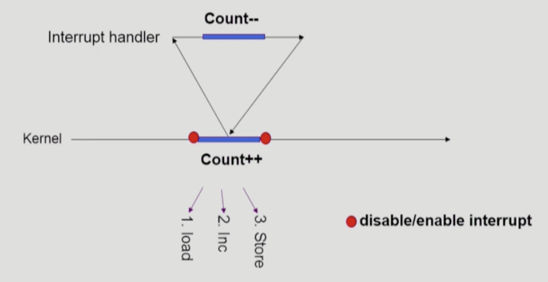
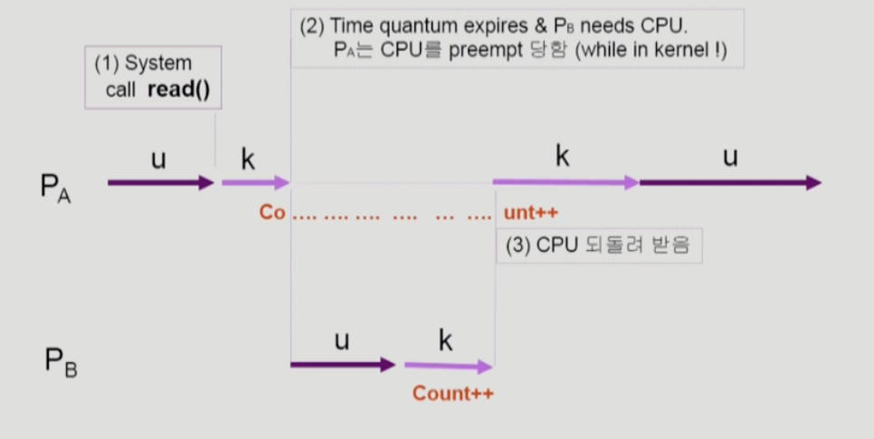
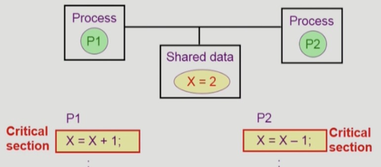
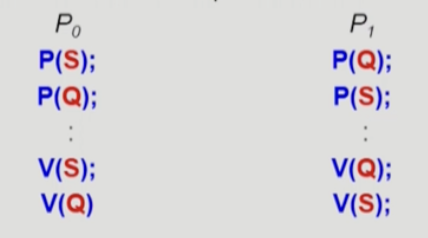

# [6장] Process Synchronization

## OS에서 race condition이 발생하는 경우

1. kernel 수행 중 인터럽트 발생 시
2. Process가 system call을 하여 kernel mode로 수행 중인데, context switch가 일어나는 경우
3. Multiprocessor에서 shared memory 내의 kernel data

## OS에서의 race condition - 1



- 커널 모드 중 interrupt가 발생하여 인터럽트 처리 루틴이 수행
    - 양쪽 다 커널 코드이므로 address space를 공유함
- count를 load하는 과정까지 진행 → interrupt 처리하러 감 → count를 1 감소시킴 → 다시 돌아오는데, 이전에 load했던 데이터를 1 증가시키고 저장함
- 작업이 끝날 때 까지는 interrupt를 처리하지 않도록 하면 됨

## OS에서의 race condition - 2



- 1번의 경우와 마찬가지로 load 까지하고 time quantum이 끝나서 다른 프로세스에게 넘어갔는데, 그 프로세스도 count를 증가시키려고 함
    - 총 2가 증가해야되는데, A가 이전에 load 한 값을 증가시켜서 저장하기 때문에 B프로세스가 증가시킨 값은 적용이 안됨
- 커널 모드에 있을 때 CPU를 뺏기지 않도록 하면 됨

## Critical Section



- 하나의 프로세스가 critical setion에 있을 때 다른 모든 프로세스는 critical section에 들어갈 수 없어야 한다.

## 해결 방법

- 상호 배제 (Mutual Exclusion)
    - 어떤 프로세스가 critical section에 있으면 다른 프로세스는 들어가면 안된다.
- 진행 (Progress)
    - 아무도 critical section에 없는데, 어떤 프로세스가 들어가고 싶은 경우엔 들여보내줘야된다.
- 유한 대기 (Bounded Waiting)
    - 프로세스 A가 요청한 후부터 그 요청이 허용될 때까지 다른 프로세스들이 critical section에 들어가는 횟수에 한계가 있어야한다.
    - starvation이 발생하면 안된다.

### 피터슨 알고리즘

- 어떤 프로세스의 차례인지를 나타내는 turn과 어떤 프로세스가 사용하겠다고 손을 든  것인지를 나타내는 flag 변수를 모두 사용하여 해결
- CPU를 써가면서 기다리는(while 계속 반복) Busy Waiting 문제 발생

## Semaphore

사용 가능한 자원을 가리키는 S는 정수임, 추상적인 개념

```c
semaphore mutex; // initially 1

do {
	P(mutex);
	critical section
	V(mutex)
} while (1);
```

P연산: 사용 가능한 S 감소 (S—)

V연산: 사용 가능한 S 증가 (S++)

- 위의 피터슨 알고리즘에서의 lock 구현은 S가 1인 경우라고 생각하면 된다.
    - 뮤텍스 = binary semaphore
- block & wake up 방식을 사용해서 busy waiting 해결

## Deadlock

둘 이상의 프로세스가 서로 상대방의 자원을 요구할 때 무한히 기다리는 현상



- 문제 상황
    - S와 Q가 1로 초기화된 세마포어라고 가정
    - P0는 세마포어 S와 Q 순서로 사용한 뒤, 반납하는 형태이고, P1은 Q와 S 순서로 사용한 뒤 반납하는 형태
    - P0가 S를 얻어 lock을 S— 했는데, CPU를 뺏겨 P1으로 넘어가서, P가 Q를 Q— 함
    - P1은 S를 얻어야 하는데, 이미 S는 0이라서 P0가 S를 줄 때까지 기다려야함
    - S는 Q를 얻고 나서야 반납되기 때문에 무한히 기다림

  해결 방법

    - 자원을 얻는 순서를 동일하게 하면 됨 (S→Q or Q→S)

## Monitor

- Semaphore의 문제점
    - 코딩하기 힘듦
    - 정확성의 입증이 어려움
    - 한 번만 실수해도 시스템에 치명적
- 모니터는 lock을 걸 필요가 없음
    - 모니터 내에서는 한 번에 하나의 프로세스만이 활동하도록 설계되어있음