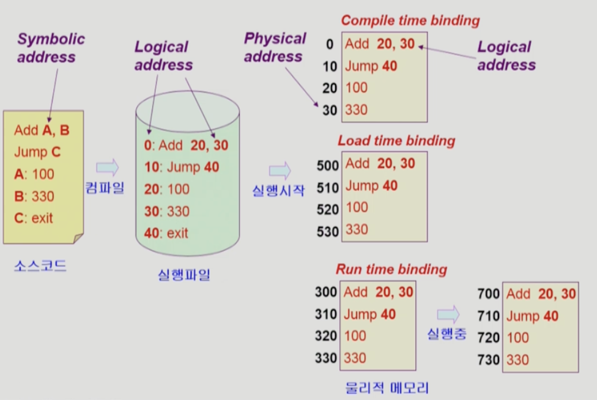
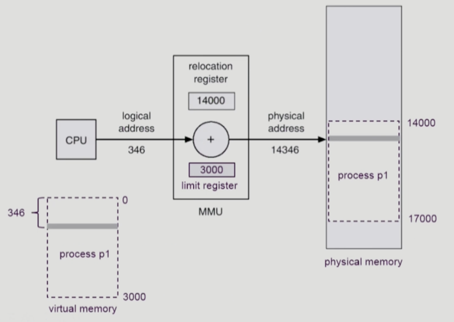
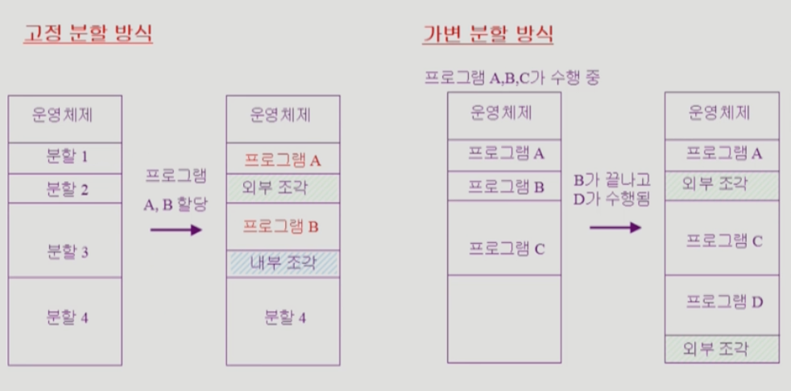
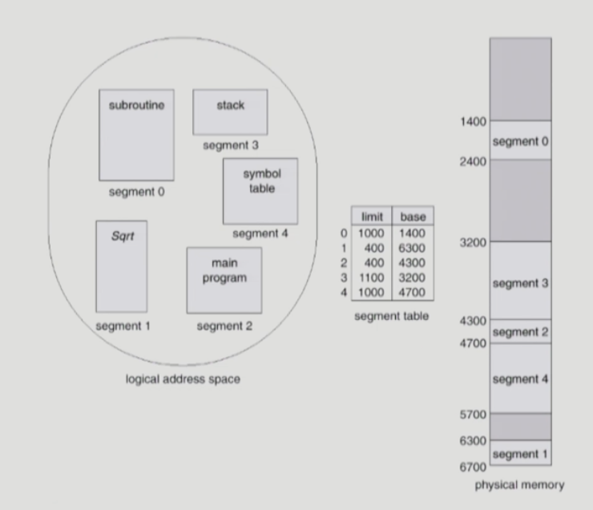
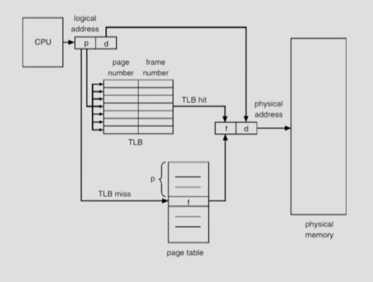
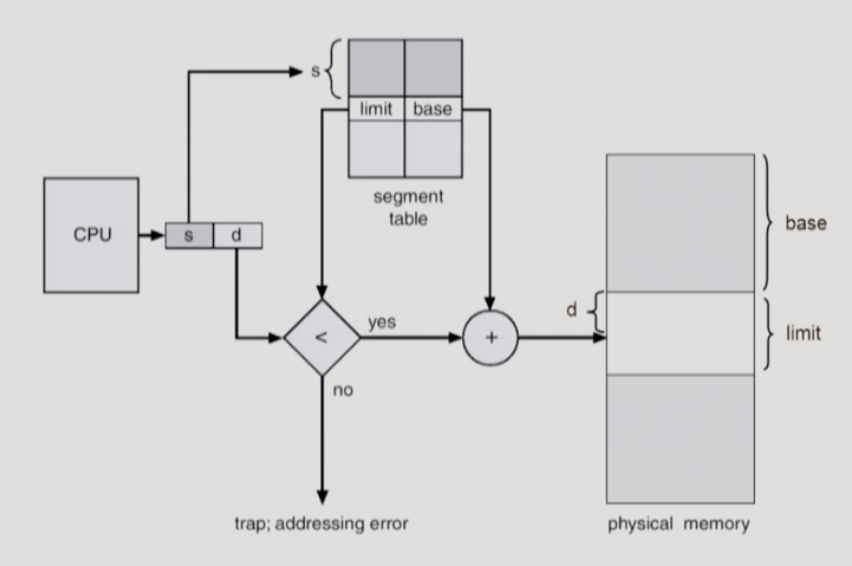

# [8장] Memory Management

## Logical vs Physical Memory

- Logical address (Virtual address)
    - 프로세스마다 **독립적으로** 가지는 주소 공간
    - 0번지부터 시작
    - CPU가 바라보는 주소
- Physical address
    - 메모리에 실제로 올라가는 위치

⇒ Logical address → Physical address로 **주소 변환**이 이루어져야 함

## 주소 바인딩 (Address Binding)

### Compile time binding

- 물리적 메모리 주소가 컴파일 시 알려짐
    - 위의 그림에서 Logical address가 Physical address가 됨
    - Physical memory에 비어있는 주소들이 있을 때도 정해진 주소로 올리게 됨 (비효율적)

### Load time binding

- 물리적 메모리 주소가 실행 시에 결정됨

### Run time binding

- 경우에 따라서 다른 메모리 주소로 바뀔 수도 있음
- **MMU**가 binding을 도와줌

### CPU가 바라보는 메모리는 놀랍게도 logical address이다.

- 위의 경우에, 컴파일 했을 때 명령어가 “Add 20, 30”인데, 이때 20과 30 자체를 실제 메모리 주소로 바꾸려면 다시 컴파일을 해야한다.
- CPU가 20, 30에 있는 것을 달라고 요청을 하면, 그때마다 메모리 주소 변환을 통해 해당 값을 가져오는 것이다.

## MMU (Memory Management Unit)

- MMU는 relocation register와 limit register로 주소 변환을 한다.
- 시작 위치를 정해두고, 그에 해당하는 offset만큼 계산해서 가져옴
- limit register는 프로세스 크기보다 더 큰 주소의 값을 요청할 때를 대비한다.

## Dynamic Loading

- 프로그램이 필요할 때마다 메모리에 올리는 것
- 운영체제가 해주는게 아니라, 프로그래머가 하는 것
    - 운영체제가 해주는 것은 **페이징**

## Swapping

- 프로세스를 일시적으로 메모리에서 backing store(HDD)로 쫓겨나는 것
- 중기 스케줄러가 priority를 기준으로 swap out 시킴

## Dynamic Linking

- 라이브러리가 프로그램 실행 파일 코드에 포함이 되는 것이 아니라, 라이브러리가 실행될 때 해당 라이브러리를 찾아서 실행함

---

## Allocation of Physical Memory

연속 할당

- Fixed partition allocation
- Variable partition allocation

불연속 할당

- Paging
- Segmentation
- Paged Segmentation

## 연속 할당

하나의 프로세스가 메모리 공간에 연속적으로 할당함

### 고정 분할 방식 (Fixed partition)

- 프로그램 A가 분할 1에 들어가고, 프로그램 B는 크기가 조금 커서 분할 2에는 들어가지 못하고 분할 3에 들어간다 하자
    - 이때 분할 1과 분할 3 사이의 **외부에 낭비되는 공간**을 **External Fragmentation**, 분할 3 **내부에 낭비되는 공간**을 **Internal Fragmentation**이라고 한다.

### 가변 분할 방식 (Variable partition)

- 프로그램 크기들이 균일하지 않아서, External Fragmentation은 생긴다.
- 프로세스의 크기를 hole에 넣을 때 어떻게 넣는지에 대한 방법이 여럿 있다.
    - First-fit: Size가 n 이상인 것 중 최초로 찾아지는 hole에 할당
    - Best-fit: Size가 n 이상인 것 중 가장 작은 hole에 할당
    - Worst-fit: 가장 큰 hole에 할당

## 불연속 할당

하나의 프로세스가 여러 개의 메모리 공간에 상주함

## Paging

- 프로세스의 virtual memory를 동일한 사이즈의 page 단위로 나눔
- Virtual memory의 내용이 page 단위로 **불연속**하게 저장됨
  - Physical memory 또한 동일한 크기로 나눠야되는데, 이를 **frame**이라고 함
  - 즉 page는 frame과 크기가 같다
- **page table**을 사용하여 logical address 를 physical address로 변환
- Internal Fragmentation은 발생할 수 있음

### Page Table 구현 방식

그렇다면 page table은 어디에 있을까?

- main memory에 존재하고 프로세스마다 가짐
- 모든 연산에는 2번의 메모리 접근을 함
  - page table 접근
  - 실제 데이터 접근
- 성능 향상을 위해서 TLB (Translation Look-aside Buffer)를 둠
  - lookup **hardware cache**임
  - 단순 주소 변환을 위한 cache
- Two-Level Page Table
  - page table을 하나 더 두어서, 공간을 효율적으로 사용함
  - 4GB의 주소 공간을 가지는 프로그램에서, page size가 4KB라면, 1M개의 page table entry가 필요함
  - outer page table에 **사용되지 않는 주소 공간에 대해서는 inner page table이 없게함**

### Memory Protection

Page Table의 각 entry마다 아래의 bit를 둔다.

- Protection bit
  - 어떤 페이지는 프로그램의 code 영역, 어떤 페이지는 프로그램의 data 영역일 수 있기 때문에, 각 페이지마다 read만 해야하는지, write도 할 수 있는지에 대한 구분을 해줘야함
- Valid-Invalid bit
  - 해당 주소의 frame에 그 프로세스를 구성하는 내용이 있는지 없는지를 의미함

## Segmentation

Page는 같은 크기로 쪼갠 것이라면, Segment는 **의미 단위**로 쪼갠 것

Page는 개수가 100만개 막 이런데, Segment는 개수가 훨씬 적음 → 위치를 저장할 table의 용량에 부담이 되지 않음

### Protection

- 각 세그먼트 별로 protection bit가 있음
- 의미 단위라서 Page에 비해 protection bit를 사용하는 것이 쉬움

### Sharing

- 의미 단위라서 공유와 보안에 있어 효과적임
  - 공유는 의미 단위로 해야 의미가 있으니까

### Allocation

- first fit / best fit
- 크기가 다르다보니 external fragmentation 발생

### Segmentaion Hardware

- Segment table
  - base
  - limit
- Segment-table base register
  - Physical memory에서 segment table의 위치
- Segment-table length register
  - 프로그램이 사용하는 segment 수
  - segment가 3개인데, 5번째꺼를 고르라고 한다면 에러가 나겠죠

### Segmentation with paging

- sement table entry가 **segment를 구성하는 page table의 base address**를 가지고 있음 (segment의 base address를 가지는게 아님)
- Physical memory에 올라갈 때는 page 단위로 올라감