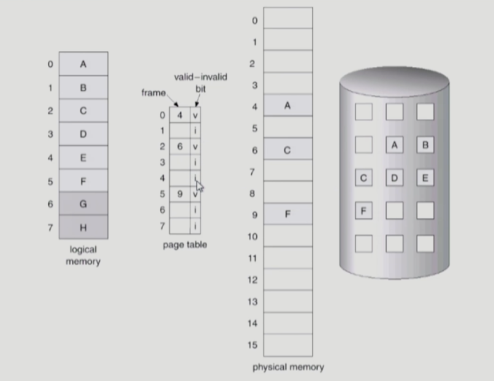
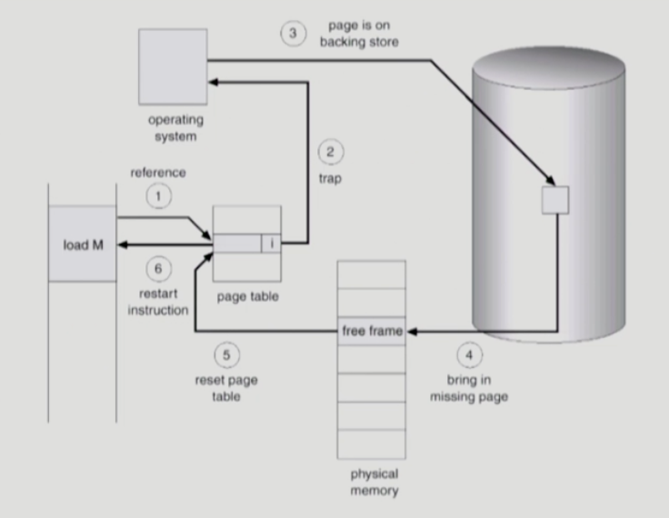
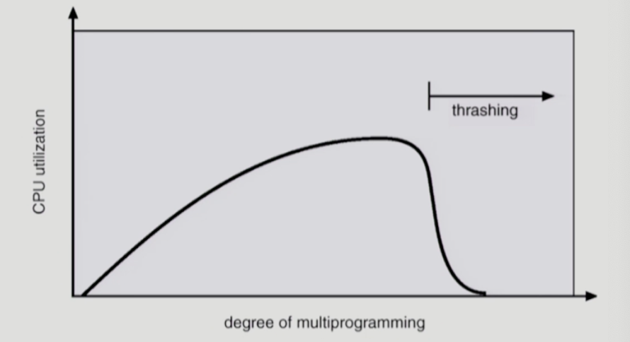

## [9장] Virtual Memory

## Demand Paging

- 실제로 필요할 때 page를 메모리에 올리는 것
    - I/O 양 감소
    - Memory 사용량 감소
    - 빠른 응답 시간
- Valid/Invalid bit
- 현재 필요한 A,C,F는 Physical memory에 올라가있고, 나머지는 Backing store에 있다.

## Page Fault

CPU가 B에 접근하려고 봤더니 invalid임 → 디스크에서 가져와야됨 (I/O 작업)

- 이런 경우 MMU가 trap을 발생시킴 (I/O 작업이니까)
- page fault handler invoke
    1. invalid한지 확인
    2. 비어있는 page frame 가져오기
        1. 없으면 뺏어옴
    3. disk에서 memory로 해당 페이지를 읽어옴
    4. 이 프로세스가 CPU 잡고 다시 Running

⇒ 그렇다면 어떻게 page frame을 뺏을까?

### Page Replacement

가장 나중에 참조되는 page를 replace하면 되지만, 미래를 알 수 없으니 최대한 이에 가깝게 알고리즘을 짜야함

- FIFO
    - 가장 먼저 들어온 것 삭제
- LRU
    - 가장 오래 전에 사용된 것부터 삭제
    - 가장 먼저 들어왔어도 재사용 된 것은 삭제 순위가 낮음
    - LinkedList로 구현되어있어 **O(1)로 삭제** 가능 (가장 최근 것이 가장 우선순위가 낮기 때문)
- LFU
    - 참조 횟수가 가장 적은 페이지 삭제
    - 가장 적은 페이지가 여러 개 있으면?
        - 임의로 선정 혹은 가장 오래 전에 참조된 페이지를 지우면 될듯
    - 참조 횟수를 하나씩 비교해야하기 때문에 O(N) 시간 걸리게 됨
        - 그래서 **Heap을 사용해서 O(logN)으로 접근**하게 함!

<aside>
❓ Page Fault가 일어났을 때만 운영체제가 관여한다. LRU나 LFU를 사용하려면 이전 정보들을 토대로 LinkedList를 새로고침해야 하는데, 이 작업은 운영체제가 해야하는 작업이다. 근데 Page Fault가 일어나지 않고 page가 참조되었을 때 운영체제는 어떤 일도 관여하지 않기 때문에 참조가 되었다는 정보를 토대로 LinkedList를 고칠 수 없다. 그래서 **Page Replacement에는 LRU, LFU 같은 알고리즘을 사용할 수 없다.**

</aside>

### Clock Algorithm

- LRU의 근사 알고리즘
- NRU (Not Recently Used)로도 불림
- page hit 시 reference bit을 업데이트하여, 추후 page fault 시 운영체제가 참고하여 교체함

## Thrashing

프로그램에게 메모리가 너무 적게 할당되면, page fault가 계속해서 일어나는데, 이를 Thrashing이라고 함

- 프로그램 개수가 특정 개수 이상으로 늘어나면 CPU utilization이 급격하게 떨어진다.
- Working-Set algorithm
    - Locality
        - 프로세스는 특정 시간 동안 일정 위치만을 집중적으로 참조함
    - 집중적으로 참조되는 해당 page들의 집합을 working set이라고 함
    - Working Set 모델에서는 working set 전체가 메모리에 올라와 있지 않으면 모든 frame을 반납하고 swap out됨
- PFF (Page-Fault Frequency)
    - Page fault rate의 상한값과 하한값을 둬서 frame을 더 할당하거나 줄임