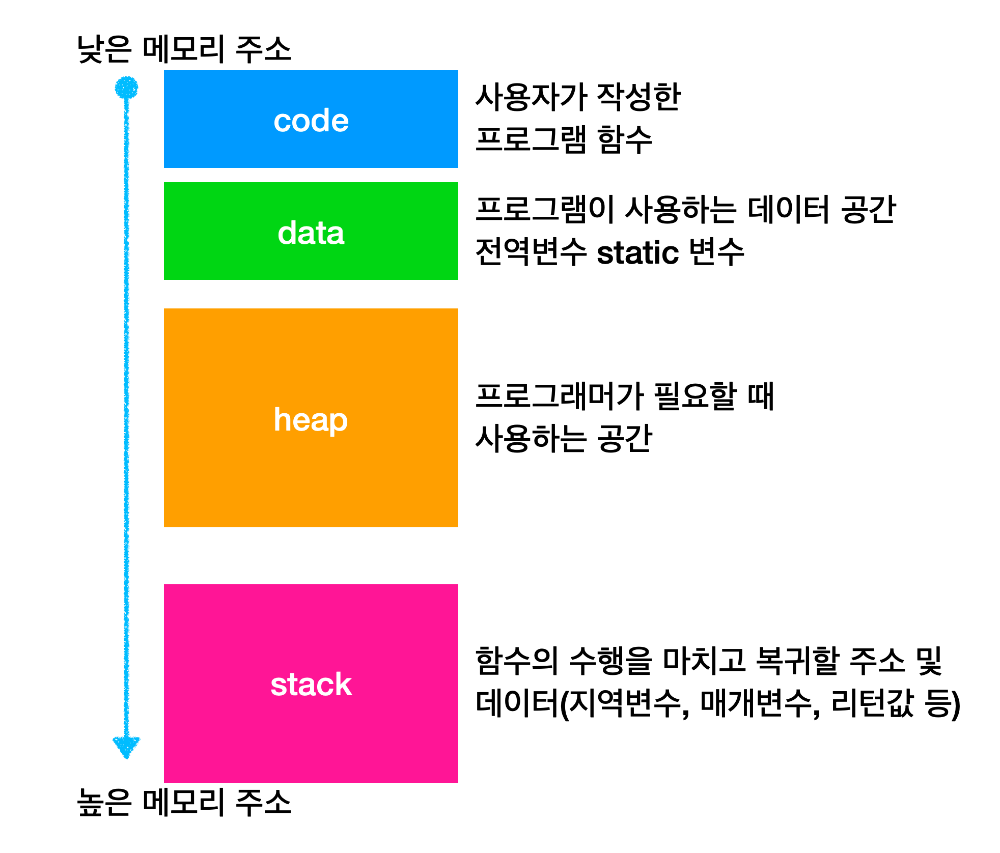
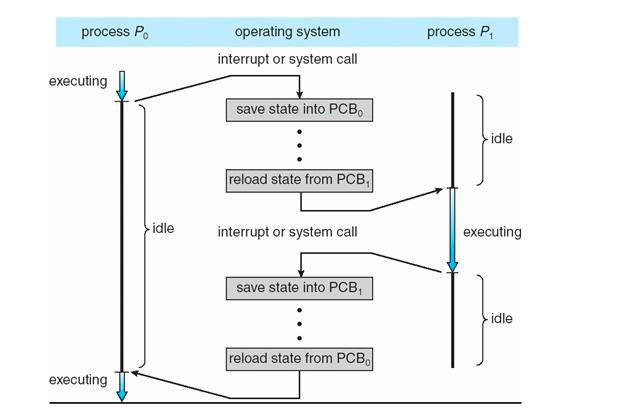

# 프로세스와 스레드

## 프로세스와 컴파일 과정

1. 전처리
    1. 소스 코드 주석 제거
    2. #include 등 헤더 파일 병합
2. 컴파일러
    1. 오류 처리, 코드 최적화
    2. 어셈블리어로 변환
3. 어셈블러
    1. 목적 코드(object code)로 변환
    2. 취업.c → 취업.o
4. 링커
    1. 프로그램 내에 있는 라이브러리 함수와 목적 코드를 결합하여 실행 파일 만듦
    2. .exe, .out

## 프로세스의 상태

### 생성 상태

- 프로세스가 생성된 상태
- fork() 또는 exec() 함수를 통해 생성
    - fork(): 부모 프로세스의 주소 공간을 그대로 복사하여 새로운 자식 프로세스 생성
        - 공간만 복사함 → 부모 프로세스의 비동기 작업 등을 상속하지는 않음
    - exec(): 새롭게 프로세스 생성
- PCB가 할당됨

### 대기 상태

- 메모리 공간이 충분하면 메모리를 할당받고 아니면 대기

### 대기 중단 상태

- 메모리 부족으로 일시 중단된 상태

### 실행 상태

- CPU 소유권과 메모리를 할당받아 프로세스가 실행 중인 상태

### 중단 상태

- 어떤 이벤트(I/O 인터럽트 등)가 발생한 이후 프로세스가 차단되어 대기 중인 상태

### 일시 중단 상태

- 중단된 상태에서 실행되려고 하는데 메모리 부족으로 일시 중단된 상태

### 종료 상태

- 메모리와 CPU 소유권 모두 놓고 가는 상태
- 부모 프로세스가 자식 프로세스를 강제로 종료시킬 수도 있음

## 프로세스의 메모리 구조

### 코드 영역

- 프로그램에 내장되어 있는 소스 코드가 들어가는 영역
- 기계어

### 데이터 영역

- 전역변수, 정적변수 저장
- BSS 영역과 Data 영역으로 나뉨
    - BSS 영역: 초기화 되지 않은 변수가 0으로 초기화되어 저장
    - Data 영역: 0이 아닌 다른 값으로 할당된 변수들이 저장

### 힙

- 동적 할당시 사용됨
- 런타임 시 크기 결정
- 동적임

### 스택

- 지역변수, 매개변수, 함수
- 컴파일 시 크기 결정됨
- 동적임 → 힙과 스택의 메모리 영역이 겹치면 안되기 때문에 둘 사이 공간 비워둠

## PCB (Process Control Block)

- 운영체제에서 프로세스에 대한 메타데이터를 저장한 데이터
- **프로세스가 생성되면 운영체제는 해당하는 PCB를 생성**
- 프로그램 실행 → 프로세스 생성 → 스택, 힙 등의 구조 기반으로 메모리 할당 → 프로세스의 메타 데이터들이 PCB에 저장되어 관리
- 커널에서 관리됨

### PCB 구조

- 프로세스 스케줄링 상태
- 프로세스 ID
- 프로세스 권한
- 프로그램 카운터: 프로세스에서 실행해야 할 다음 명령어의 주소에 대한 포인터
- CPU 레지스터
- CPU 스케줄링 정보
- 계정 정보
- I/O 상태 정보

### 컨텍스트 스위칭

- PCB를 교환하는 과정
- 프로세스에 할당된 시간이 끝나거나 인터럽트에 의해 발생

- 유휴 시간(idle), 캐시미스 등의 비용 발생
    - 프로세스가 가지고 있는 메모리 주소가 그대로 있으면 잘못된 주소 변환이 생기 때문에 캐시클리어 과정이 필요함 → 캐시클리어 이후에는 캐시미스 발생
- 스레드에서도 컨텍스트 스위칭이 일어남
    - 스택 영역을 제외한 모든 메모리를 공유하기 때문에 비용 더 적고 시간도 적게 걸림

## 멀티프로세싱

- 특정 프로세스의 메모리, 프로세스 중 일부에 문제가 생겨도 다른 프로세스를 이용해서 처리할 수 있음
- 독립적인 프로세스가 병렬로 수행됨

### 웹 브라우저

- 브라우저 프로세스: 북마크 막대, 뒤로 가기, 앞으로 가기 등을 담당, 네트워크 요청, 파일 접근 같은 권한 담당
- 랜더러 프로세스: 보여지는 모든 부분 제어
- 플러그인 프로세스: 웹 사이트에서 사용하는 플러그인 제어
- GPU 프로세스: GPU를 이용해서 화면을 그리는 부분 제어

> 여러 개의 탭을 켜놨을 때 하나의 탭에서 오류가 나도 다른 탭은 영향을 받지 않는 이유가 멀티프로세싱을 사용하였기 때문임 (각 탭마다 프로세스 생성함)
>

### IPC (Inter Process Communication)

- 프로세스끼리 데이터를 주고받고 공유 데이터 관리
    - ex) 클라이언트: 데이터 요청, 서버: 요청에 응답
- 공유 메모리, 파일, 소켓, 익명 파이프, 명명된 파이프, 메시지 큐 등
    - 공유 메모리
        - 여러 프로세스에 동일한 메모리 블록에 대한 접근 권한 부여
        - 오버헤드 발생 X
        - 동기화 필요
    - 파일
        - 디스크에 저장된 데이터, 파일 서버에서 제공한 데이터
    - 소켓
        - 동리한 컴퓨터의 다른 프로세스나 네트워크의 다른 컴퓨터로 데이터 전송
    - 익명 파이프
        - FIFO 방식의 공간인 파이프를 기반으로 데이터 주고받음
        - 단방향 방식의 읽기 전용, 쓰기 전용 파이프 만들어서 사용
        - 부모, 자식 프로세스 간에만 사용 가능 (네트워크 상에서 사용 X)
    - 명명된 파이프
        - 클라이언트/서버 통신을 위한 별도의 파이프
        - 컴퓨터의 프로세스, 다른 네트워크 상의 컴퓨터와도 통신 가능
    - 메시지 큐
        - 커널의 전역변수 형태 등으로 커널에서 관리됨
        - 직관적이고 간단함
        - 프로세스 A → 메시지 큐 → 프로세스 B

## 공유 자원

- 경쟁 상태
    - 두 개 이상의 프로세스가 동시에 읽거나 쓰는 상황

## 임계 영역

- 공유 자원에 접근할 때 순서 등의 이유로 결과가 달라지는 영역
- 해결 방법: 뮤텍스, 세마포어, 모니터
    - 상호 배제
        - 다른 프로세스 접근 불가
    - 한정 대기
        - 임계 영역에 영원히 들어가지 못하면 안됨
    - 융통성 충족
        - 다른 프로세스의 일을 방해하면 안됨

### 해결 방법 1 - 뮤텍스

- 사용하기 전에 설정 → 사용한 후 해제
- 하나의 상태만 가짐 (잠금 or 해제)
- **단일 스레드 또는 프로세스**가 공유 자원에 독점적으로 접근하는 것을 보장
- Lock, Unlock 연산

### 해결 방법 2 - 세마포어

- 여러 스레드 또는 프로세스가 동시에 공유 자원에 접근하는 것을 제어하고 조절
- Produce(P), Consume(V) 연산
- 세마포어 수행 방식
    1. 프로세스가 공유 자원에 접근
    2. 세마포어에서 wait() 수행
        1. wait(): 자신의 차례가 올 때까지 기다리는 함수
    3. 프로세스가 공유 자원 해제
    4. 세마포어에서 signal() 수행
        1. signal(): 다음 프로세스로 순서 넘겨주는 함수

### 해결 방법 3 - 모니터

- 둘 이상의 스레드나 프로세스가 공유 자원에 접근할 수 있도록 조절하기 위한 동기화 도구
- 모니터 큐를 통해 작업들을 순차적으로 처리

## 교착 상태

- 두 개 이상의 프로세스들이 서로가 가진 자원을 기다리며 중단된 상태

### 원인

- 상호 배제
    - 한 프로세스가 독점 → 다른 프로세스 접근 불가
- 점유 대기
    - 특정 프로세스가 점유한 자원을 다른 프로세스가 요청
- 비선점
    - 다른 프로세스의 자원을 강제로 못가져옴
- 환형 대기
    - A → B, B → A 의 자원을 요구하는 상황

### 해결 방법

1. 애당초 조건이 성립되지 않도록 설계
2. 교착 상태 가능성이 없을 때만 자원 할당
    1. 은행원 알고리즘: 총 자원의 양과 현재 할당한 자원의 양을 기준으로 안정, 불안정 상태로 나누어 자원 할당
3. 사이클 삭제